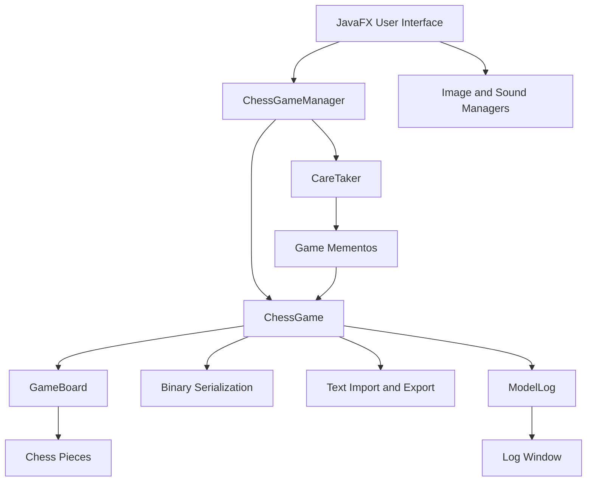

<div align="center">

# JavaFX Chess

### Desktop chess application focused on object-oriented design and software patterns


</div>

## Overview

**JavaFX Chess** is a local two-player chess application developed with Java and JavaFX.

The project combines chess-rule modelling, object-oriented programming, desktop interface development, persistence and reusable software-design patterns.

Players interact with a responsive graphical board while the application validates legal moves, controls turns, detects game-ending states and maintains a reversible movement history.

The application also provides a learning mode, a free board editor, saved-game support and a separate real-time model-log window.

> [!NOTE]
> The project is an educational desktop application. It does not currently provide online multiplayer or a computer-controlled opponent.

## Main Features

### Chess Gameplay

The application supports:

- Local two-player matches;
- Standard movement rules for every chess piece;
- Turn validation;
- Friendly-piece collision prevention;
- Path validation for bishops, rooks and queens;
- Detection of moves that leave the player's own king in check;
- Piece capture;
- Check detection;
- Checkmate detection;
- Stalemate detection;
- Draw by insufficient material;
- Pawn promotion;
- Castling;
- En passant implementation under additional validation.

### Learning Mode

Learning mode helps users understand legal movement possibilities.

When a piece is selected, all currently legal destination squares are highlighted on the board.

The highlighted moves already exclude moves that would leave the player's king in check.

### Undo and Redo

The game supports reversible moves through the Memento pattern.

Before a valid move is executed, a snapshot of the complete game state is stored. The user can then:

- Undo previous moves;
- Restore undone moves;
- Preserve piece-specific state such as pawn movement history;
- Restore turn and board information consistently.

### Board Editor

Edit mode allows users to build custom chess positions.

Users can:

- Start with an empty board;
- Add pieces;
- Remove pieces;
- Select piece type and colour;
- Configure player names;
- Select which team moves first;
- Save the edited position as a playable game;
- Export the position as text.

### Persistence

The application provides two persistence formats.

#### Binary game files

```text
.dat
```

Binary serialization stores a complete game state that can later be reopened.

#### Text board files

```text
.txt
```

The text format allows board positions to be imported, exported and edited manually.

### Model Logs

A separate JavaFX window displays model events in real time, including:

- Completed movements;
- Invalid operations;
- Pawn promotion;
- Undo and redo;
- Game start;
- Game ending.

The current version allows logs to be viewed and cleared during execution.

### Multimedia

The interface supports:

- Piece images;
- Movement sound sequences;
- Capture sounds;
- Check notifications;
- Promotion sounds;
- Sound activation and deactivation.

Only resources with confirmed redistribution rights should be included in public builds.

## Architecture

The application follows an MVC-oriented structure.



## Design Patterns

### MVC

| Layer | Main Components |
| --- | --- |
| Model | `ChessGame`, `GameBoard`, pieces and players |
| View | JavaFX panes, canvas, menus and dialogs |
| Controller/Facade | `ChessGameManager` |

The interface does not directly manipulate the internal game state. User operations pass through `ChessGameManager`.

### Facade

`ChessGameManager` exposes a simplified API for:

- Starting games;
- Moving pieces;
- Loading and saving;
- Importing and exporting;
- Undo and redo;
- Learning mode;
- Edit mode;
- Querying game state.

### Memento

The Memento pattern stores complete game snapshots.

| Component | Implementation |
| --- | --- |
| Originator | `ChessGame` |
| Memento | `GameMemento` |
| Caretaker | `CareTaker` |

### Factory

Piece creation is centralised through:

- `PieceFactory`;
- `PieceFactoryText`.

The first creates pieces from enumerations, while the second converts textual representations into chess pieces.

### Observer

`PropertyChangeSupport` is used to notify the interface about:

- Board changes;
- Turn changes;
- Check;
- Game ending;
- Learning mode;
- Edit mode;
- Undo and redo;
- New log entries.

### Singleton

`ModelLog` and `AlertManager` centralise shared logging and dialog behaviour.

## Chess Model

The main hierarchy is based on the abstract `Piece` class.

```text
Piece
├── Pawn
├── Rook
├── Knight
├── Bishop
├── Queen
└── King
```

Every piece implements its own movement rules while `GameBoard` manages:

- Board positions;
- Piece lookup;
- Path validation;
- Legal-move filtering;
- Check detection;
- Checkmate detection;
- Stalemate;
- Insufficient material;
- Promotion.

## Technology Stack

| Area | Technology |
| --- | --- |
| Language | Java 23 |
| Desktop interface | JavaFX 23.0.1 |
| Build system | Apache Maven |
| Testing | JUnit 5 |
| Persistence | Java serialization and text files |
| Observability | `PropertyChangeSupport` |
| Audio | JavaFX Media |
| Drawing | JavaFX Canvas |
| Collections | Java Collections Framework |
| Architecture | MVC-oriented |
| Design patterns | Facade, Memento, Factory, Observer and Singleton |

## Project Structure

```text
src/
├── main/
│   ├── java/
│   │   └── pt/isec/pa/chess/
│   │       ├── ChessApp.java
│   │       ├── model/
│   │       │   ├── ChessGameManager.java
│   │       │   ├── data/
│   │       │   └── memento/
│   │       └── ui/
│   │           ├── alerts/
│   │           ├── res/
│   │           └── services/
│   └── resources/
│       ├── images/
│       │   └── pieces/
│       └── sounds/
└── test/
    └── java/
        └── pt/isec/pa/chess/
```

## Requirements

Install:

- JDK 23;
- Apache Maven 3.9 or newer;
- A desktop operating system supported by JavaFX.

Check the installed versions:

```bash
java -version
mvn -version
```

## Running

Clone the repository:

```bash
git clone https://github.com/DaviGama08/javafx-chess.git
cd javafx-chess
```

Run the tests:

```bash
mvn clean test
```

Start the application:

```bash
mvn clean javafx:run
```

## Building

Compile and test:

```bash
mvn clean verify
```

Create the Maven package:

```bash
mvn clean package
```

The generated build output is placed under:

```text
target/
```

## Example Gameplay

1. Start the application;
2. Select **Game → New**;
3. Enter the names of the white and black players;
4. Select a piece;
5. Select a valid destination;
6. Activate learning mode to highlight legal moves;
7. Use undo or redo when required;
8. Save the game as a `.dat` file.

## Testing

The current model tests cover:

- Pawn movement;
- Path validation;
- Pawn promotion detection;
- Check detection;
- Legal-move filtering;
- Checkmate;
- Stalemate;
- Draw by insufficient material.

Run:

```bash
mvn test
```

Additional tests are planned for special moves, persistence and movement history.

## Current Limitations

- En passant requires additional edge-case validation;
- There is no computer-controlled opponent;
- There is no online multiplayer;
- Draw by repetition is not implemented;
- The fifty-move rule is not implemented;
- Player clocks are not implemented;
- Log export is not implemented;
- Automated testing currently focuses mainly on `GameBoard`;
- The binary save format depends on compatible Java classes;
- Multimedia resources must have verified redistribution licences.

## Potential Improvements

Future development could include:

- Complete en passant test coverage;
- Threefold-repetition detection;
- Fifty-move-rule detection;
- Player clocks;
- Algebraic move notation;
- PGN import and export;
- Computer opponent;
- Online multiplayer;
- Configurable themes;
- Keyboard navigation;
- Accessibility improvements;
- Log export;
- Broader unit and UI testing;
- Native packages with `jpackage`.

## Academic Context

JavaFX Chess was developed collaboratively for the **Advanced Programming** course of the Bachelor's Degree in Computer Engineering at the **Instituto Superior de Engenharia de Coimbra — ISEC**, during the 2024/2025 academic year.

The project focused on:

- Advanced object-oriented programming;
- JavaFX desktop interfaces;
- Model-view separation;
- Design patterns;
- Serialization;
- Observability;
- Unit testing.

## Contributors

- **Davi Gama** — [@DaviGama08](https://github.com/DaviGama08)
- **Miguel Francisco Pires Lopes** — add GitHub profile
- **Ruben Apolinário Almeida** — add GitHub profile

## Licence

No open-source licence has currently been assigned.

The source code is available for portfolio and educational review. Reuse, modification or redistribution requires permission from the project authors.

---

<div align="center">

Developed as an advanced object-oriented programming project.

</div>
